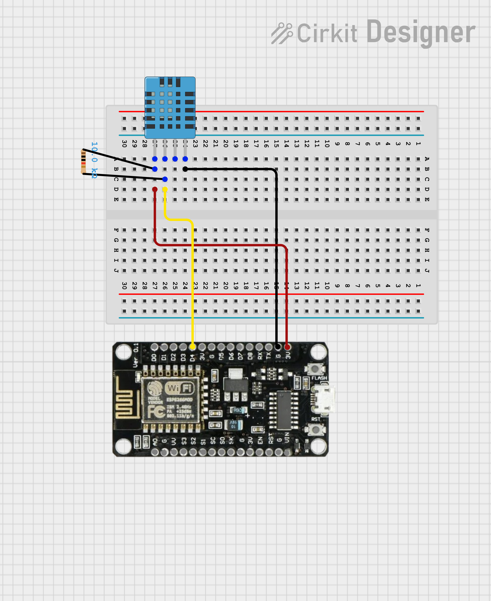
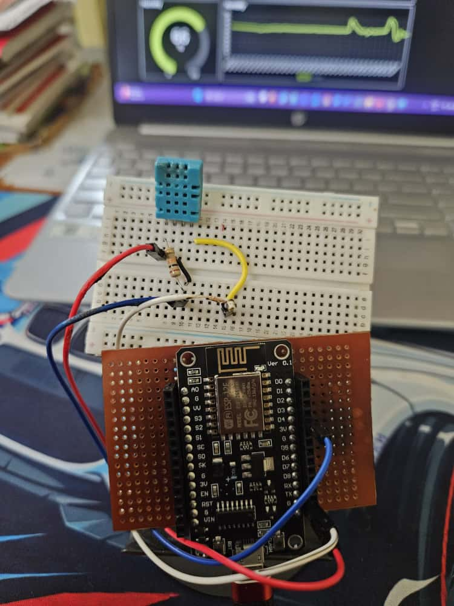
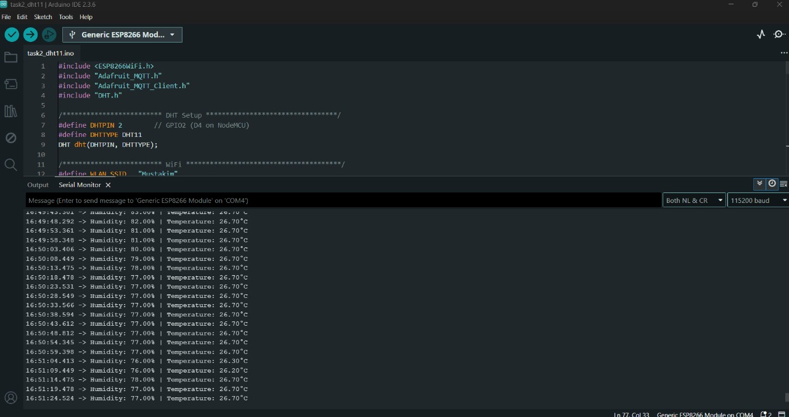
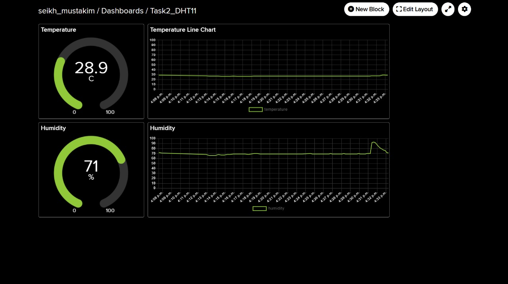

# **DHT11-Based IoT Temperature & Humidity Monitoring System**

This project is part of **Arduino Winter Internship 2025 – Task 2**.
It demonstrates a real-time IoT system that reads environmental data from a **DHT11 sensor** and uploads it to **Adafruit IO** using MQTT for cloud visualization.

In this setup:

* The **DHT11** sensor measures temperature and humidity.
* The **ESP8266 NodeMCU** connects to WiFi and uploads data every second.
* **Adafruit IO Dashboard** displays live readings through gauges and graphs.

---

## **Project Overview**

The ESP8266 reads data from the DHT11 sensor and publishes it to Adafruit IO.
On the dashboard, temperature and humidity are displayed in real time.

This system demonstrates:

* IoT data logging
* MQTT-based cloud communication
* Live dashboard visualization
* Basic sensor integration with ESP8266

The project fulfills all requirements for Task 2.

---

## **Hardware Used**

* ESP8266 NodeMCU
* DHT11 Temperature & Humidity Sensor
* Jumper wires
* USB cable

---

## **Circuit Diagram**



### **DHT11 Connections**

* VCC → 3.3V
* GND → GND
* DATA → D4 (GPIO 2)
* *Optional:* 10k pull-up resistor between VCC and DATA

---

## **Setup Photo**



---

## **ESP8266 Code**

The complete program is located in the repository:

👉 `code/dht11_data_logging.ino`

The code performs:

* WiFi connection
* MQTT connection to Adafruit IO
* Reading temperature and humidity
* Publishing data every 1 second
* Serial Monitor logging

---

## **Serial Monitor Output**



---

## **Adafruit IO Dashboard**



The dashboard displays:

* Temperature (°C)
* Humidity (%)
* Real-time gauge updates
* Historical feed logs via Adafruit IO

---

## **Demo Video**

A short demonstration video shows the complete setup, live data logging, and the Adafruit dashboard.

👉 **[Demo Video Link](https://drive.google.com/file/d/1u36vJzkR97-bo2GQL8OaG67ndW62gIG_/view?usp=drivesdk)**

The video includes:

* Sensor wiring
* ESP8266 connectivity
* Serial Monitor readings
* Cloud dashboard updates

---

## **Repository Structure**

```
📁 TASK 2
│── code/
│     └── dht11_data_logging.ino
│
│── images/
│     ├── circuit_diagram.png
│     ├── dashboard.jpg
│     ├── serial_monitor.jpg
│     └── setup.jpg
│
└── README.md
```
